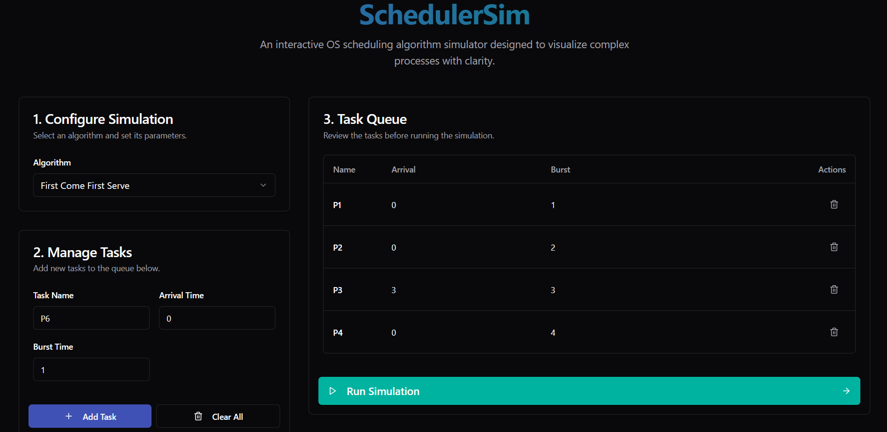
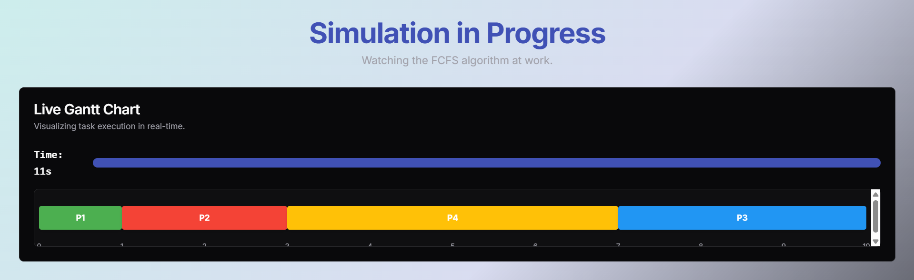
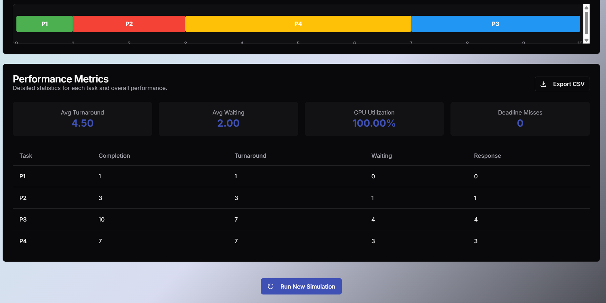

# ⚙️ CPU Scheduler  
### *Visualize. Simulate. Understand CPU Scheduling*

An **interactive web-based CPU Scheduling Simulator** designed to help students and learners understand **Operating Systems scheduling algorithms** through real-time visualization and performance analysis.

🌐 **Live Demo:**  
👉 https://cpu-scheduler-aditya.vercel.app

---

## 🚀 Features of the Website

- 🧮 Supports **multiple CPU scheduling algorithms**
- 📊 **Real-time Gantt Chart visualization**
- ⚙️ Configurable parameters (quantum, priority, deadlines)
- ⏱️ Automatically computes performance metrics:
  - Waiting Time  
  - Turnaround Time  
  - CPU Utilization  
- 🔄 Step-by-step simulation with animation
- 🌙 Modern **dark-themed UI**
- 🌐 Fully deployed on **Vercel**
- 📱 Responsive and user-friendly interface

---

## 🧮 Scheduling Algorithms Supported

The simulator includes both **classical** and **real-time** CPU scheduling algorithms:

### 🟢 Classical Scheduling Algorithms
- **First Come First Serve (FCFS)**
- **Shortest Job First (Non-Preemptive)**
- **Shortest Job First (Preemptive / SRTF)**
- **Priority Scheduling (Non-Preemptive)**
- **Priority Scheduling (Preemptive)**
- **Round Robin (RR)**

### 🔵 Real-Time Scheduling Algorithms
- **Earliest Deadline First (EDF)**
- **Rate Monotonic Scheduling (RMS)**

Each algorithm is visualized using a **Dynamic Gantt chart**, allowing users to clearly observe task execution order and timing.

---

## 📊 Performance Metrics Displayed

- Average Waiting Time  
- Average Turnaround Time  
- CPU Utilization  
- Overall scheduling behavior through charts  

> Note: CPU utilization may appear as 100% when no idle time is modeled, which is a valid assumption in continuous scheduling scenarios.

---

## 📸 Screenshots

### 🏠 Home / Configuration Page

### ⚙️ Simulation in Progress

### 📊 Results & Performance Analysis

---

## 🧠 Educational Purpose

This project is developed as part of an **Operating Systems course**, aiming to provide a **visual and interactive approach** to understanding CPU scheduling concepts that are traditionally taught using theory and tables.

---

## 🛠️ Tech Stack

- **Next.js (App Router)**
- **React + JSX**
- **JavaScript (ES6)**
- **Tailwind CSS**
- **Recharts**
- **Vercel (Deployment)**

---

## 👨‍💻 Author

**Aditya Kumar Jha**  
🎓 Student | 💻 Developer  

⭐ If you find this project helpful, consider starring the repository!
